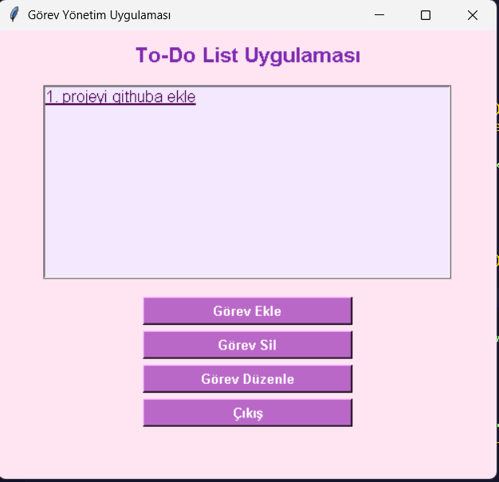

# toDoListApp
Tkinter kullanarak geliştirilen temel görev yönetimi uygulaması 
## 🎯 Özellikler
- Görev ekleme
- Görevleri listeleme
- Görev düzenleme
- Görev silme
- Grafiksel kullanıcı arayüzü (GUI)

## 🖥️ Kullanılan Teknolojiler
- Python 3.x
- Tkinter (yerleşik GUI kütüphanesi)

 
